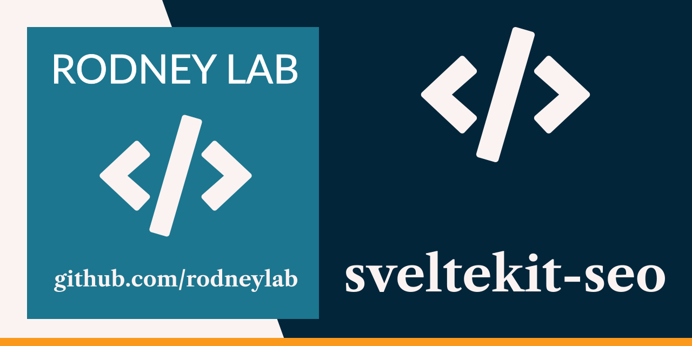

<p align="center">
  <a aria-label="Open Rodney Lab site" href="https://rodneylab.com" rel="nofollow noopener noreferrer">
    
  </a>
</p>
<h1 align="center">
  SvelteKit SEO
</h1>

[](https://app.netlify.com/sites/inspiring-heyrovsky-49f468/deploys)

# sveltekit-seo

See the [SvelteKit SEO blog post on the Rodney Lab site](https://rodneylab.com/sveltekit-seo/) for more on how to set this site up. There is a live demo at [sveltekit-seo.rodneylab.com](https://gatsby-serverless-rust.rodneylab.com/).

Please drop questions into a comment at the bottom of that page. Here's the quick start:

## Creating your Own MDsveX Blog Site with SEO Components

If you're seeing this, you've probably already done this step. Congrats!

```bash
git clone https://github.com/rodneylab/sveltekit-seo.git my-new-mdsvex-blog
cd my-new-mdsvex-blog
pnpm install # or npm install
npm run dev
```

## Building

```bash
npm run build
```

> You can preview the built app with `pnpm run preview`, regardless of whether you installed an adapter. This should _not_ be used to serve your app in production.